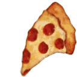
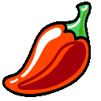
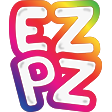
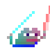

# favorite-slack-emojis
Set of my favorite slack emojis to use 🙂

### Saving gif from preview
Sometimes I edit gifs in macOS preview, but saving seems to break the looping behavior. To fix that I used `imagemagick` `convert` (`brew install imagemagick`)
```
❯ convert -loop 0 source.gif destination.gif
```

### Intensify
Creates a gif that jitters around "intensifyingly".

Use as
```sh
./intensify.sh {input_file} {output_file}
```

### Party-ify
Creates a rainbow gradient gif with a "smoothness" level that controls how abrupt the color shifting is. I've found 3/4 to be a nice sweet-spot.

Use as
```sh
./party-ify.sh {input_file} {output_file} {smoothness level}
```


### Party-ify GIF
Creates a rainbow gradient gif with a "smoothness" level that controls how abrupt the color shifting is. It's basically identical to the other, but it cycles the hue through the existing gif frames. It also includes an  `fuzz` factor to compress the gif if the file size gets too big

Use as
```sh
./party-ify-gif.sh {input_file} {output_file} {smoothness level} {optional fuzz percentage}
```


## `:gopher_peek:`


## `:sad_peek:`


## `:blob_sad:`


## `:cowboy_peek:`


## `:dogjam:`


## `:kermit_typing:`


## `:kermit_wut:`


## `:kermit_yaaaaay:`


## `:rage_cry:`


## `:blob-wave-peek:`


## `:meow_wave_peek:`


## `:finger_guns:`


## `:finger_guns2:`


## `:sad_finger_guns:`


## `:sad_finger_guns2:`


## `:meow_comfy_fingerguns:`


## `:meow_comfy_peek:`


## `:anticipation:`


## `:hhhehehe:`


## `:yeet_party:`


## `:true:`


## `:party_pizza:`


## `:pizza_wave:`


## `:party-merge:`


## `:blink:`


## `:doot-doot:`


## `:cowboy-eyes:`


## `:cowboy-ghost:`


## `:pizza_peek:`


## `:peek_template:`


## `:pizza_activated:`


## `:not_like:`


## `:argo_intensifies:`


## `:gopher_coffee:`


## `:gopher_beer:`


## `:gopher_intensifies:`


## `:spicy-party:`


## `:ez-pz:`


## `:ez-pz-party:`


## `:pepe-jedi:`


## `:pepe-jedi-party:`

